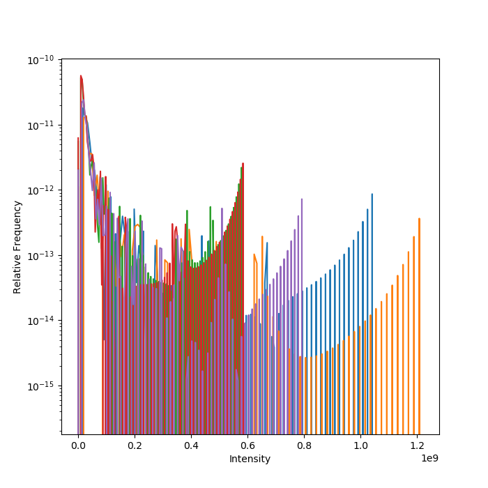
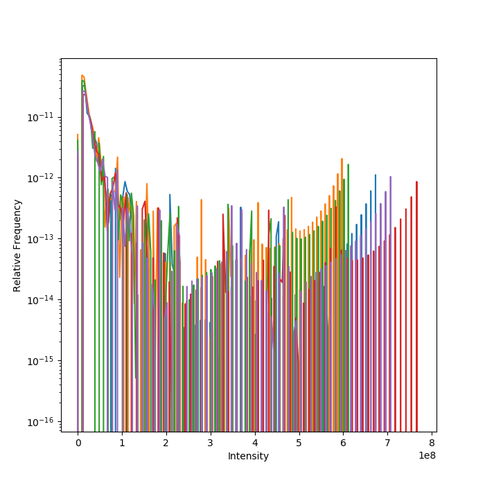
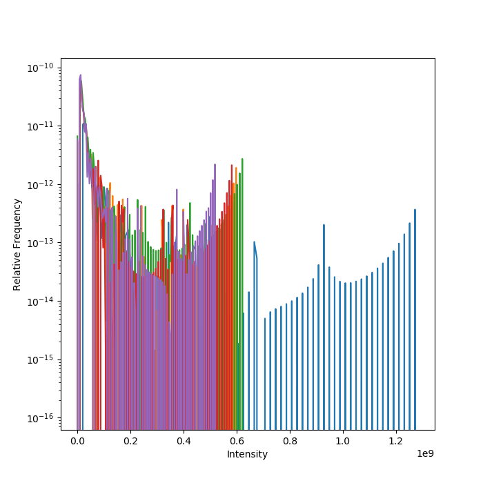
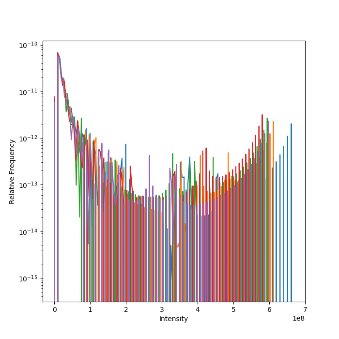
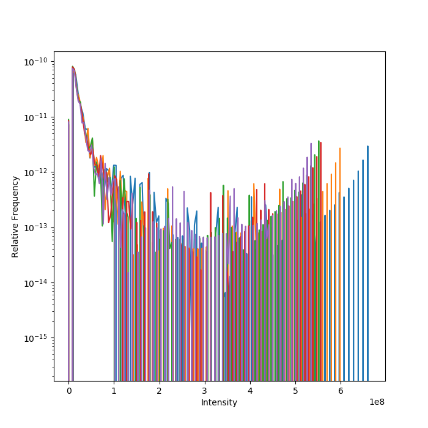
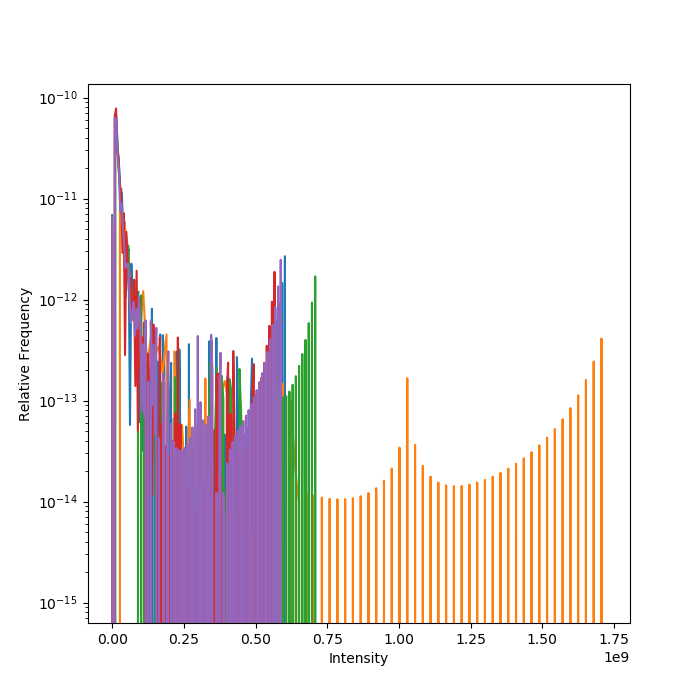
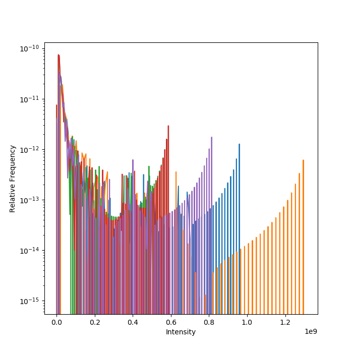
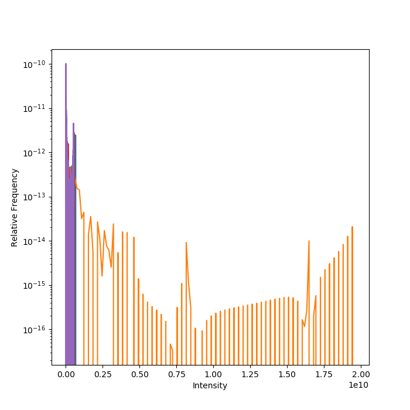
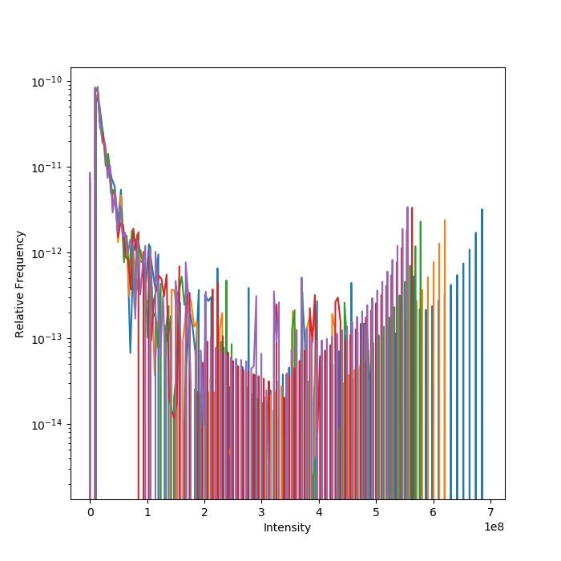

# Notebook for PSSS3 project

## 2019-06-09 Checking the intensity distribution of the set

I ploted the intensity distribution of the peptides within each of the samplegroups within the PSSS3 set, using this [code](../exp/check_normalization/check_normalization.py). Each reolicate is given a color of its own.

#### S01

#### S02

#### S03

#### S04

#### S05

#### S06

#### S07

#### S08

#### S09

The different replicates appears do be very differently normalised.

--LK
